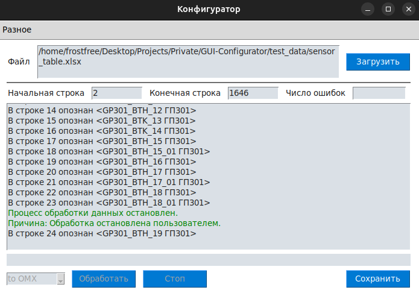

## Кофигуратор Юрика
### Описание
Приложение для автоматизированной обработки датчиков из excel-таблицы в сырые omx-объекты для dev-studio.
Разработано на коленке за крутую футболку и коробку фруктов

---

### Запуск проекта
Для запуска проекта необходимо наличие `python3.10` и старше.

- Установите необходимые зависимости командой.
_Предварительно рекомендую активировать виртуальную среду_
```shell
pip install -r requirements
```

- Запустите программу указав в качестве аргумента - путь до файла `main.py`
```shell
python ./app/main
```

---

### Интерфейс
<div align="center">
    
</div>

### Инструкция

_coming soon..._

### Что-то важное от Юрика про датчики

| Яч.+переменная     | Атрибут                       | Пример           | Блоки               | Комментарий                |
| ------------------ |:----------------------------- |:---------------- | ------------------- | -------------------------- |
| [D**]NAME**        | Имя датчика                   | GPA_QT_100       | Все                 |                            |
| [N]SIREN_TYPE      | Тип оповещателя               | Свет             | SHOP                |                            |
| [Q]COLOR_ON        | Цвет при сработке             | Красный          | SHPS SHOP DI DO     |                            |
| [J]GP              | Мнемосхема                    | ГПА31            | Все                 |                            |
| [P]SOUND_ON        | Звук при сработке             | Пожар            | SHPS SHOP DI DO     | Под вопросом нужно или нет |
| [E]DESCRIPTION     | Описание                      | ГПА-31.Г-р QT202 | Все                 |                            |
| [-]SEVERITY        | Важность при сработке         | 2                | SHPS SHOP DI DO     | Формируется из SOUND_ON    |
| [Y]IVXX_TP         | Входн. знач./Адр. подкл.      | 2+7              | SHPS SHOP QSA DI AI |                            |
| [L]E_UNIT          | Единицы измерения             | %                | QSA AI              |                            |
| [N]SENSOR_POSITION | Позиция датчика               | QT100            | QSA AI              |                            |
| [O,N]SENSOR_TYPE   | Тип датчика                   | КТД-50           | SHPS QSA DI AI      | 2 SHPS AI проверить        |
| [N]SUBSTANCE       | Тип вещества                  | Метан            | QSA                 |                            |
| [AD]IFEX_TP        | Неисправность   пер.          | 3+1              | QSA                 | (3 модуль TREI, 1 канал)   |
| [Z]IT1X_TP         | 1 порог                       | 3+2              | QSA                 |                            |
| [AA]IT2X_TP        | 2 порог                       | 3+3              | QSA                 |                            |
| [O]MESSAGE_ON      | Сообщение при сработке        | .Пожар           | SHPS DI             |                            |
| [K]PAR_NAME        | Обозначение пар-ра в СИ       | T                | AI                  | Тип.изм.(P,L,dP,F)         |
| [N]SECOND_QUEUE    | Нал. второй оч. г. туш.       | 1                | UPG                 |                            |
| [-]FRAC_DIGITS     | кол-во цифр после зап. у ан-х | 2                | QSA AI              | По умолч. в функц - 2      |

---

```xml
<ct:object name="DO" access-level="public" uuid="54cd6969-f334-4893-b36b-dc9293cd4cba">
    <attribute type="unit.Server.Attributes.NodeRelativePath" />
    <attribute type="unit.Server.Attributes.IsObject" value="false" />
</ct:object>
```
Эти строчки создают папку в DevStudio, для определенного типа устройств в данном случае DO.
Они необходимы только в первом блоке набора одного типа датчиков.
